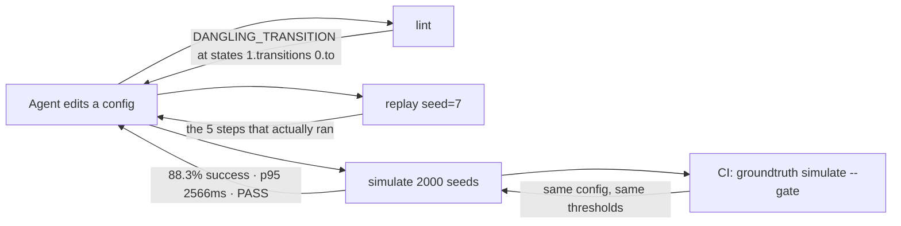

# groundtruth-mcp

[](https://github.com/ZhenGtai123/groundtruth-mcp/actions/workflows/ci.yml)
[](https://github.com/ZhenGtai123/groundtruth-mcp/blob/main/pyproject.toml)
[](https://github.com/ZhenGtai123/groundtruth-mcp/blob/main/LICENSE)

**Your coding agent can read every file in your repo and still be guessing.**
This turns your project's own checks, replays, simulations and queries into MCP
tools, so it observes the consequences of its edit instead of predicting them.

[中文文档](https://github.com/ZhenGtai123/groundtruth-mcp/blob/main/README.zh-CN.md) · [Adoption guide](https://github.com/ZhenGtai123/groundtruth-mcp/blob/main/docs/ADOPTION.md) ·
[Architecture](https://github.com/ZhenGtai123/groundtruth-mcp/blob/main/docs/ARCHITECTURE.md) · [Why fixed seeds](https://github.com/ZhenGtai123/groundtruth-mcp/blob/main/docs/DETERMINISM.md)

---

## The problem

An agent editing a structured config — a workflow graph, a rules file, a state
machine, a pipeline definition — is working with the wrong kind of context. It
can read the schema. It cannot read what happens when the thing runs.

So it infers. It changes a retry limit and tells you the change is safe,
because "safe" was the most plausible next token given a diff that looked
reasonable. Nobody ran anything. The constraint it violated lives in an
invariant three files away, or in a distribution nobody has sampled since the
policy was last tuned.

The fix is not a better prompt. It is giving the agent something to observe.

## What it does



Five tools, built from four small functions you write:

| Tool | Answers | Property that makes it useful |
|---|---|---|
| `lint` | Is this config self-consistent? | Every issue carries the exact path to edit |
| `replay` | What happens when I run *this* one? | Pure function of `(config, seed)` — reproducible anywhere |
| `simulate` | Is my change better or worse overall? | Seeded batch, distribution, thresholds, pass/fail |
| `query` | What is actually in the data? | Read-only enforced by the database, not by a regex |
| `describe_data` | What tables exist? | So nothing has to guess a schema |

The same capabilities run as a CLI, so `groundtruth simulate --gate` is a merge
gate reading the *same* thresholds the agent optimises against. They cannot
drift, because there is only one copy.

## Sixty seconds

```bash
pip install "groundtruth-mcp[mcp]"

git clone https://github.com/ZhenGtai123/groundtruth-mcp && cd groundtruth-mcp
groundtruth --config examples/checkout-flow/groundtruth.toml lint broken_checkout
```

The bundled example is a config-driven checkout: four pages, a flaky payment
gateway, a retry policy, customers who leave. `broken_checkout.json` contains
the mistakes an agent actually makes when editing config it cannot run.

```
broken_checkout: BLOCKED  errors=6 warnings=1 infos=0
source: flows\broken_checkout.json

-- ERRORS — these block (6) --
[DANGLING_TRANSITION] states[1].transitions[0].to  'payment_methd' does not name any states.id
    fix: point it at an existing state id, or delete the transition
[DEAD_END] states[6]  'review_hold' has no outgoing edge and is not marked terminal — a run that arrives here stops with no result
    fix: give it a transition, or mark it kind = "terminal" with an outcome
[DUPLICATE_STATE] states[2]  duplicate id='shipping' (first declared at states[1])
    fix: rename one of them; the engine silently uses the first and ignores the rest
[RATE_OUT_OF_RANGE] policy.gateway_failure_rate  1.4 is above the maximum 1.0
    fix: this is a probability, not a percentage — 0.18, not 18
[RETRY_BUDGET_TOO_THIN] policy.max_retries  140% gateway failure with 1 retries leaves 196.0% of checkouts failing on payment alone (budget: 2.0%)
    fix: raise max_retries, or lower gateway_failure_rate if the gateway improved
[UNKNOWN_STATE_KIND] states[3].kind  'stage' is not one of ['step', 'gateway', 'retry', 'terminal']
    fix: the engine only knows these four kinds; anything else is treated as a plain step

-- WARNINGS (1) --
[UNREACHABLE_STATE] states[4]  'gift_wrap' cannot be reached from 'cart_review'
    fix: no path from start reaches this state — delete it, or wire it in
```

Six of those come from a rule file. `RETRY_BUDGET_TOO_THIN` comes from eight
lines of Python, because "does this retry budget meet the product's failure
target" is arithmetic, not a schema.

Now watch one run:

```bash
groundtruth --config examples/checkout-flow/groundtruth.toml replay standard_checkout --seed 3
```

```
standard_checkout  seed=3  outcome=success  steps=7  fingerprint=52b66a2024a61b5d
metrics: latency_ms=2506  payment_attempts=2  steps=7

-- TRACE --
  0. cart_review --always-->
  1. shipping --always-->
  2. payment_method --always-->
  3. authorize --failure-->  # attempt 1 declined
  4. retry_decision --retries_left-->  # 0 retry(s) used of 2
  5. authorize --success-->  # attempt 2 authorized
  6. confirmed  # terminal: success
```

Seed 3 always produces those seven steps — on your machine, in CI, next year.
That is what makes it worth reading.

And two thousand of them:

```bash
groundtruth --config examples/checkout-flow/groundtruth.toml \
  simulate standard_checkout --runs 2000 --seed 0 --gate --check-determinism
```

```
standard_checkout: PASS  runs=2000  base_seed=0  fingerprint=449e16b50c8184c0

-- OUTCOMES --
  success: 1767 (88.3%)
  abandoned: 227 (11.3%)
  payment_failed: 6 (0.3%)

-- METRICS (mean / p50 / p95 / max) --
  latency_ms: 1587.75 / 1553 / 2566 / 3626
  payment_attempts: 1.06 / 1 / 2 / 3
  steps: 5.12 / 5 / 7 / 10

-- THRESHOLDS --
  PASS  rate:success = 0.8835  expected >= 0.8  (below this, the flow is losing customers faster than the business case allows)
  PASS  rate:stuck = 0  expected <= 0  (a run with nowhere to go is always a config bug, never bad luck)
  PASS  p95:latency_ms = 2566  expected <= 4000  (95th-percentile checkout wall time, retries included)
  PASS  mean:payment_attempts = 1.0585  expected <= 1.6  (rising attempts mean the gateway is degrading or the retry policy is too eager)

note: determinism: 20 seeds re-ran identically
```

## The part that earns its keep

Raise one number — `shipping.abandon_chance` from `0.05` to `0.28`, the kind of
edit that looks like a product tweak and passes review:

```
$ groundtruth lint standard_checkout
standard_checkout: OK  errors=0 warnings=0 infos=0     # exit 0

$ groundtruth simulate standard_checkout --runs 2000 --seed 0 --gate
standard_checkout: FAIL  runs=2000  base_seed=0  fingerprint=5a7c0d9feed5adca

-- OUTCOMES --
  success: 1336 (66.8%)
  abandoned: 660 (33.0%)

-- THRESHOLDS --
  FAIL  rate:success = 0.668  expected >= 0.8
  PASS  rate:stuck = 0  expected <= 0
  PASS  p95:latency_ms = 2549  expected <= 4000
  PASS  mean:payment_attempts = 0.795  expected <= 1.6
                                                       # exit 1
```

Structurally perfect. Twenty-one points of conversion gone. No schema, type
system or code review catches that; a seeded batch with a declared band catches
it in four seconds, on the pull request, before a human reads the diff.

It works in the other direction too. `express_checkout` posts a *higher* success
rate than the standard flow — 91.0% — and is the worse config: its payment
failures are 3.9% against 0.3%, hidden inside a headline number that looks
fine. The aggregate misses it; the hand-written validator says so plainly:

```
[RETRY_BUDGET_TOO_THIN] policy.max_retries  18% gateway failure with 1 retries
leaves 3.2% of checkouts failing on payment alone (budget: 2.0%)
```

Neither layer subsumes the other. That is why there are two.

## Adopting it

One module, one config file. `examples/checkout-flow/groundtruth_app.py` is the
whole template — about a hundred lines including comments.

```python
from groundtruth_mcp import Context, Issue, Loaded, Toolkit, Trace

kit = Toolkit(name="my-project", subject_noun="pipeline")

@kit.loader
def load(name: str):
    path = CONFIG_DIR / f"{name}.yaml"
    if not path.is_file():
        return None                        # → "no pipeline named X; available: ..."
    return Loaded(subject=parse(path), source=str(path))

@kit.validator
def check(pipeline, ctx: Context) -> list[Issue]:
    ...                                    # the checks a rule file can't express

@kit.runner
def run_once(pipeline, seed: int, ctx: Context) -> Trace:
    ...                                    # one run, pure in (pipeline, seed)
```

`@kit.runner` alone gives you both `replay` and `simulate` — the library runs it
once per seed and keeps the outcome. Everything else (seed batching,
aggregation, percentiles, threshold gating, output budgeting, error phrasing,
the MCP surface) comes from the package.

```toml
# groundtruth.toml
[project]
toolkit = "groundtruth_app:kit"

[lint]
rules = "rules.toml"

[[thresholds]]
metric = "rate:success"
min = 0.80
note = "why this number, for whoever has to change it"
```

Then `groundtruth doctor` tells you what is wired up, `groundtruth serve` hands
the tools to an agent, and `groundtruth simulate --gate` blocks the merge. Full
walkthrough with per-domain examples: **[docs/ADOPTION.md](https://github.com/ZhenGtai123/groundtruth-mcp/blob/main/docs/ADOPTION.md)**.

## Rules you get for free

Structural checks are declared, not written. Twelve types, each covering a way
structured configs actually rot:

| Type | Catches | Key fields |
|---|---|---|
| `required_fields` | half-written entries | `select`, `fields` |
| `unique_key` | duplicate ids the engine silently shadows | `select`, `key` |
| `enum` | a value your engine does not handle | `select`, `values` |
| `type` | a string where a number belongs | `select`, `expect` |
| `range` | `1.4` in a field that is a probability | `select`, `min`, `max` |
| `pattern` | ids that break a naming contract | `select`, `regex` |
| `not_empty` | an empty list where one entry is required | `select` |
| `ref_exists` | a reference to something that was renamed | `select`, `collection`, `key` |
| `reachable` | a node no path from start reaches | `collection`, `key`, `edges`, `start` |
| `no_dead_end` | a non-terminal node with no way out | `collection`, `key`, `edges`, `terminal_field` |
| `no_self_loop` | a node that transitions to itself | `collection`, `key`, `edges` |
| `no_cycle` | a ring with no exit (with an `allow` list for the intentional ones) | `collection`, `key`, `edges` |

Selectors are a deliberately small path language — `states[].transitions[].to`
— and every match reports the concrete path it was found at, which is what
makes `states[3].transitions[1].to` possible instead of "a transition is
invalid".

Each rule takes an optional `code`, `severity` and `hint`. The hint is the
sentence an agent acts on, so write it in the imperative.

## Read-only means read-only

`query` runs one `SELECT`. Two layers enforce that, and they are not equals.

The keyword scan is user experience: it rejects `DELETE FROM …` with a sentence
saying so, instead of a database error the model has to decode. It is **not**
the boundary — a blocklist over text is always one case away from wrong, and
the canonical demonstration is `SELECT * INTO audit_copy FROM users`, which
starts with `SELECT`, contains no denied verb, and creates a table.

The boundary is the datastore: `mode=ro` plus `PRAGMA query_only` on SQLite, a
`READ ONLY` transaction on PostgreSQL, a statement timeout on both. The tests
go around the guard entirely and confirm the connection still refuses.

Column redaction is the one text-level control that *is* enforcement: values in
`deny_columns` are dropped after the fetch and before the result string exists,
so `SELECT *` cannot leak them. Everything returned is wrapped in `<untrusted>`
tags, because a `notes` column containing something shaped like an instruction
is data and has to arrive labelled as data.

## CLI

```
groundtruth [--config PATH] <command>

  doctor                     what is wired up, what is missing
  targets                    the configs this project exposes
  lint TARGET                exit 1 on errors
  replay TARGET --seed N     one deterministic run, full trace
  simulate TARGET            --runs N --seed N --gate --check-determinism
  query "SELECT ..."         one read-only statement
  schema                     readable tables and columns
  serve                      the MCP server, over stdio
```

Exit codes: `0` clean, `1` findings (lint errors, a threshold outside its band,
non-determinism), `2` could not run (bad config, missing capability, rejected
query). Add `--json` to `lint`, `replay` and `simulate` for machine-readable
output.

## Install

```bash
pip install groundtruth-mcp          # core: rules, simulation, gating, CLI
pip install "groundtruth-mcp[mcp]"   # + the MCP server
pip install "groundtruth-mcp[postgres]"  # + the PostgreSQL data source
```

Python 3.11+. **The core has no third-party dependencies** — that is deliberate,
so the CI gate does not depend on the agent stack. A bare runner can enforce
your thresholds without installing an SDK.

## Verifying a wiring

```bash
python scripts/mcp_smoke.py [path/to/groundtruth.toml]
```

Spawns the server as a real subprocess, initializes over stdio, lists tools,
calls two of them, prints what came back — the same sequence a client performs.
Run it before blaming the agent for not seeing your tools.

## What CI enforces on every pull request

Not a badge that means "the tests ran" — [six things](https://github.com/ZhenGtai123/groundtruth-mcp/blob/main/.github/workflows/ci.yml),
each of which has blocked something:

| Check | Why it is a gate and not a suggestion |
|---|---|
| `ruff check` + `ruff format --check` | Including `BLE`, so every broad `except` carries a written justification |
| `mypy` | The package ships `py.typed`; a wrong annotation is a wrong API |
| `pytest` on 3.11 / 3.12 / 3.13 | 69 tests, coverage floor 75% (currently 78% with branch coverage) |
| `scripts/mcp_smoke.py` | A real subprocess, real stdio, real `tools/list` and `tools/call` |
| `simulate --gate --check-determinism` | The project's own argument, applied to itself |
| `lint broken_checkout` **must** exit 1 | A lint that cannot fail is decorative |

## Limitations, stated plainly

- **The SQL table allowlist is textual.** It scans for identifiers after `FROM`
  and `JOIN`. Real per-table enforcement is a database grant; this is a
  guardrail with a good error message, and the read-only transaction is what
  actually holds.
- **The keyword blocklist matches inside string literals.** A query filtering on
  a value containing `grant` gets rejected. Fixing that needs a real SQL parser,
  which is not worth building when the parser is not the boundary.
- **Auto-`LIMIT` is a heuristic.** A `LIMIT` inside a subquery suppresses the
  top-level append. `max_rows` still caps what is rendered.
- **Selectors do not filter.** `states[].transitions[]` walks everything;
  there is no `states[kind=terminal]`. A predicate language would be the third
  feature nobody asked for. Write a `@kit.validator` instead.
- **Thresholds are project-wide, not per-target.** Every target in a project is
  judged against the same bands. Projects whose configs need genuinely different
  bands should be separate `groundtruth.toml` files.
- **The PostgreSQL source is implemented but lightly exercised** — the test
  suite proves the boundary against SQLite, where it can run everywhere without
  a service container.

## Where this came from

Extracted from a private codebase where the pattern earned its place: an
authoring pipeline whose contributors kept shipping configs that passed schema
validation and broke at runtime. The domain-specific parts stayed behind. What
generalised was the shape — check, replay, simulate, query — plus a set of
decisions that turned out to matter more than the feature list:

- One threshold list, read by both the agent and CI, because two copies drifted
  and the tool spent a while reporting PASS on numbers CI would have rejected.
- Errors that name the valid alternatives inline, because an agent that has to
  make a second call to learn what it may pass will instead guess.
- Tool descriptions composed from live config, because a stale description is a
  tool the agent uses wrongly and confidently.
- Output capped on every path, because one enthusiastic query can evict the
  rest of the conversation.

[docs/ARCHITECTURE.md](https://github.com/ZhenGtai123/groundtruth-mcp/blob/main/docs/ARCHITECTURE.md) has the module map and the full
reasoning.

## License

MIT.
