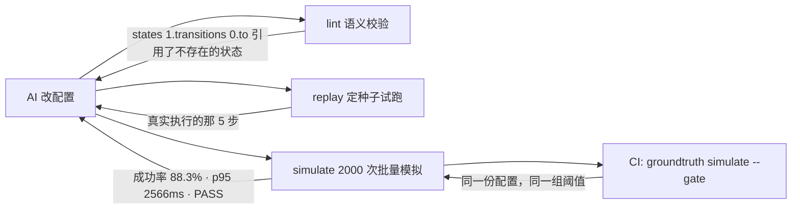

# groundtruth-mcp

[](https://github.com/ZhenGtai123/groundtruth-mcp/actions/workflows/ci.yml)
[](pyproject.toml)
[](LICENSE)

**AI 编码助手能读完你仓库里的每一个文件，然后照样在猜。**
这个项目把你自己项目里的校验、试跑、模拟和只读查询封装成 MCP 工具，让它改完
代码之后能*观察*后果，而不是*预测*后果。

[English](README.md) · [接入指南](docs/ADOPTION.md) ·
[架构说明](docs/ARCHITECTURE.md) · [为什么要固定随机种子](docs/DETERMINISM.md)

---

## 问题出在哪

当 AI 去改一份结构化配置——工作流图、规则文件、状态机、流水线定义——它拿到的
上下文是错的那一类。它能读到 schema，读不到这东西跑起来会发生什么。

于是它开始推断。它把重试次数从 2 改成 1，然后告诉你这个改动是安全的——因为在
一个看起来合理的 diff 之后，"安全"是概率最高的那个词。没有任何东西被真正执行
过。它违反的那条约束，要么藏在三个文件之外的不变量里，要么藏在一条从上次调参
以来就没人采样过的分布里。

解决办法不是把提示词写得更长，是给它一个可以观察的东西。

## 它做什么



五个工具，由你写的四个小函数拼出来：

| 工具 | 回答的问题 | 让它有用的性质 |
|---|---|---|
| `lint` | 这份配置自洽吗？ | 每条问题都带着精确到字段的路径 |
| `replay` | 跑*这一次*会发生什么？ | `(配置, 种子)` 的纯函数，到哪都能复现 |
| `simulate` | 我这次改动是变好还是变坏？ | 定种子批量跑，出分布，比阈值，给 PASS/FAIL |
| `query` | 数据里到底有什么？ | 只读由数据库强制，不是靠正则 |
| `describe_data` | 有哪些表和字段？ | 别让 AI 猜表结构 |

同一套能力还有 CLI 形态，所以 `groundtruth simulate --gate` 就是合并门禁，读的
是 AI 优化时对着的*同一份*阈值。它们不可能对不上，因为只有一份。

## 六十秒

```bash
git clone <this repo> && cd groundtruth-mcp
pip install -e ".[mcp]"
groundtruth --config examples/checkout-flow/groundtruth.toml lint broken_checkout
```

自带的示例是一个配置驱动的结账流程：四个页面、一个不稳定的支付网关、一套重试
策略、会中途走掉的顾客。`broken_checkout.json` 里放的是 AI 改一份跑不起来的配
置时真正会犯的错。

```
broken_checkout: BLOCKED  errors=6 warnings=1 infos=0

[DANGLING_TRANSITION] states[1].transitions[0].to  'payment_methd' does not name any states.id
    fix: point it at an existing state id, or delete the transition
[DEAD_END] states[6]  'review_hold' has no outgoing edge and is not marked terminal
    fix: give it a transition, or mark it kind = "terminal" with an outcome
[DUPLICATE_STATE] states[2]  duplicate id='shipping' (first declared at states[1])
[RATE_OUT_OF_RANGE] policy.gateway_failure_rate  1.4 is above the maximum 1.0
    fix: this is a probability, not a percentage — 0.18, not 18
[UNKNOWN_STATE_KIND] states[3].kind  'stage' is not one of ['step', 'gateway', 'retry', 'terminal']
[RETRY_BUDGET_TOO_THIN] policy.max_retries  140% gateway failure with 1 retries
    leaves 196.0% of checkouts failing on payment alone (budget: 2.0%)

-- WARNINGS (1) --
[UNREACHABLE_STATE] states[4]  'gift_wrap' cannot be reached from 'cart_review'
```

其中六条来自一个规则文件；`RETRY_BUDGET_TOO_THIN` 来自八行 Python——因为"这套
重试预算能不能满足产品定的失败率上限"是一道算术题，不是 schema 能表达的东西。

再看一次具体的执行：

```bash
groundtruth --config examples/checkout-flow/groundtruth.toml replay standard_checkout --seed 3
```

```
standard_checkout  seed=3  outcome=success  steps=7  fingerprint=52b66a2024a61b5d
metrics: latency_ms=2506  payment_attempts=2  steps=7

-- TRACE --
  0. cart_review --always-->
  1. shipping --always-->
  2. payment_method --always-->
  3. authorize --failure-->  # attempt 1 declined
  4. retry_decision --retries_left-->  # 0 retry(s) used of 2
  5. authorize --success-->  # attempt 2 authorized
  6. confirmed  # terminal: success
```

种子 3 永远产出这七步——在你机器上、在 CI 上、明年也一样。正因为如此，它才值得
被读。

## 真正值钱的地方

只改一个数：把 `shipping.abandon_chance` 从 `0.05` 调到 `0.28`，一个看起来像产
品微调、评审时不会有人拦的改动：

```
$ groundtruth lint standard_checkout
standard_checkout: OK  errors=0 warnings=0 infos=0     # exit 0

$ groundtruth simulate standard_checkout --runs 2000 --seed 0 --gate
standard_checkout: FAIL  runs=2000  base_seed=0  fingerprint=5a7c0d9feed5adca

  success: 1336 (66.8%)
  abandoned: 660 (33.0%)

  FAIL  rate:success = 0.668  expected >= 0.8
  PASS  rate:stuck = 0  expected <= 0
  PASS  p95:latency_ms = 2549  expected <= 4000
  PASS  mean:payment_attempts = 0.795  expected <= 1.6
                                                       # exit 1
```

结构上完全正确，转化率掉了二十一个点。这种问题 schema、类型系统、code review
一个都拦不住；一组定种子的批量模拟加一条声明好的阈值带，四秒钟就在 PR 上拦下
来了，比人读 diff 还早。

反过来也成立。`express_checkout` 的成功率比标准流程*更高*——91.0%——但它是更差
的那份配置：支付失败率 3.9% 对 0.3%，藏在一个看着挺好的总数里。聚合指标看不见
它，手写的校验直接把话说明白：

```
[RETRY_BUDGET_TOO_THIN] policy.max_retries  18% gateway failure with 1 retries
leaves 3.2% of checkouts failing on payment alone (budget: 2.0%)
```

两层谁也替代不了谁。所以才是两层。

## 怎么接到自己项目上

一个模块，一个配置文件。`examples/checkout-flow/groundtruth_app.py` 就是全部模
板，连注释一共一百行左右。

```python
from groundtruth_mcp import Context, Issue, Loaded, Toolkit, Trace

kit = Toolkit(name="my-project", subject_noun="pipeline")

@kit.loader
def load(name: str):
    path = CONFIG_DIR / f"{name}.yaml"
    if not path.is_file():
        return None                        # → "no pipeline named X; available: ..."
    return Loaded(subject=parse(path), source=str(path))

@kit.validator
def check(pipeline, ctx: Context) -> list[Issue]:
    ...                                    # 规则文件表达不了的那些检查

@kit.runner
def run_once(pipeline, seed: int, ctx: Context) -> Trace:
    ...                                    # 一次执行，对 (pipeline, seed) 是纯函数
```

只注册 `@kit.runner` 就同时得到 `replay` 和 `simulate`——库会按种子逐次调用它并
收集结果。其余全部由包提供：种子批次、聚合、分位数、阈值门禁、输出预算、错误措
辞，以及 MCP 层本身。

```toml
# groundtruth.toml
[project]
toolkit = "groundtruth_app:kit"

[lint]
rules = "rules.toml"

[[thresholds]]
metric = "rate:success"
min = 0.80
note = "写清楚这个数是怎么来的，给以后要改它的人看"
```

然后 `groundtruth doctor` 告诉你什么接上了，`groundtruth serve` 把工具交给
AI，`groundtruth simulate --gate` 卡住合并。完整流程和各领域的对照表见
**[docs/ADOPTION.md](docs/ADOPTION.md)**。

## 白送的十二种规则

结构性检查是声明出来的，不是写出来的。十二种类型，每一种对应结构化配置腐坏的
一条真实路径：

| 类型 | 抓什么 | 主要字段 |
|---|---|---|
| `required_fields` | 写了一半的条目 | `select`, `fields` |
| `unique_key` | 被引擎悄悄忽略的重复 id | `select`, `key` |
| `enum` | 引擎根本不认识的取值 | `select`, `values` |
| `type` | 该放数字的地方放了字符串 | `select`, `expect` |
| `range` | 概率字段里写了 `1.4` | `select`, `min`, `max` |
| `pattern` | 违反命名约定的 id | `select`, `regex` |
| `not_empty` | 至少要有一项的空列表 | `select` |
| `ref_exists` | 指向已被改名对象的引用 | `select`, `collection`, `key` |
| `reachable` | 从起点走不到的节点 | `collection`, `key`, `edges`, `start` |
| `no_dead_end` | 没有出边又不是终态的节点 | `collection`, `key`, `edges` |
| `no_self_loop` | 转移到自己身上的节点 | `collection`, `key`, `edges` |
| `no_cycle` | 没有出口的环（有意为之的可以进 `allow` 白名单） | `collection`, `key`, `edges` |

选择器是一套刻意做小的路径语言——`states[].transitions[].to`——每个匹配都会带上
它被找到时的具体路径，所以报错能精确到 `states[3].transitions[1].to`，而不是
"某个 transition 有问题"。

每条规则都可以覆盖 `code`、`severity` 和 `hint`。`hint` 是 AI 真正照着做的那句
话，用祈使句写。

## 只读就是只读

`query` 只跑一条 `SELECT`。两层机制保证这件事，而这两层地位并不平等。

关键词扫描是给人和 AI 看的：它用一句人话拒绝 `DELETE FROM …`，而不是甩一个数据
库报错让模型自己去解读。它**不是**安全边界——文本层面的黑名单永远差一个用例就
被绕开，教科书级的例子是 `SELECT * INTO audit_copy FROM users`：以 `SELECT` 开
头，不含任何被禁的动词，实际在建表。

边界在数据库那一侧：SQLite 用 `mode=ro` 加 `PRAGMA query_only`，PostgreSQL 用
`READ ONLY` 事务，两边都加语句超时。测试是绕过整个 guard、直接对着连接验证它仍
然拒绝写入的。

字段脱敏是唯一一个文本层的*强制*手段：`deny_columns` 里的值在取回之后、在结果
字符串生成之前就被丢掉，所以 `SELECT *` 也带不出来。所有返回的行都包在
`<untrusted>` 标签里——某个 `notes` 字段里长得像指令的一段话，本质上是数据，就
必须带着"这是数据"的标签抵达模型。

## CLI

```
groundtruth [--config PATH] <command>

  doctor                     接上了什么，缺了什么
  targets                    这个项目暴露了哪些配置
  lint TARGET                有 error 时 exit 1
  replay TARGET --seed N     一次确定性执行，完整轨迹
  simulate TARGET            --runs N --seed N --gate --check-determinism
  query "SELECT ..."         一条只读语句
  schema                     可读的表和字段
  serve                      MCP server，走 stdio
```

退出码：`0` 干净，`1` 有发现（lint 报错、阈值出带、非确定性），`2` 跑不起来
（配置错、能力没注册、查询被拒）。`lint` / `replay` / `simulate` 加 `--json` 出
机器可读结果。

## 安装

```bash
pip install groundtruth-mcp               # 核心：规则、模拟、门禁、CLI
pip install "groundtruth-mcp[mcp]"        # + MCP server
pip install "groundtruth-mcp[postgres]"   # + PostgreSQL 数据源
```

Python 3.11+。**核心没有任何第三方依赖**，这是刻意的：CI 门禁不应该依赖 AI 那
套技术栈。一台什么都没装的 runner 也能跑你的阈值检查。

## 验证接线

```bash
python scripts/mcp_smoke.py [path/to/groundtruth.toml]
```

它会把 server 作为真实子进程拉起来，走 stdio 初始化、列工具、调两个、把返回内
容打出来——和一个真实客户端做的事情完全一样。在怪 AI 看不见你的工具之前先跑
这个。

## 已知限制（如实写）

- **SQL 表白名单是文本层的**：它扫 `FROM` / `JOIN` 后面的标识符。真正的按表授权
  是数据库的 grant；这里只是一道带好错误提示的护栏，真正兜底的是只读事务。
- **关键词黑名单会误伤字符串字面量**：过滤条件里含 `grant` 的查询会被拒。要修得
  上真正的 SQL 解析器，而既然它本来就不是边界，不值得。
- **自动 `LIMIT` 是启发式的**：子查询里出现 `LIMIT` 会让外层不再追加。`max_rows`
  仍然限制最终渲染的行数。
- **选择器不支持过滤**：`states[].transitions[]` 会全部遍历，没有
  `states[kind=terminal]` 这种写法。加谓词语言就是第三个没人要的特性，需要就写
  一个 `@kit.validator`。
- **阈值是项目级的，不是按 target 分的**：同一个项目里所有 target 用同一组带。
  确实需要不同带的，拆成不同的 `groundtruth.toml`。
- **PostgreSQL 数据源实现了但测试覆盖较浅**——测试用 SQLite 验证边界，因为它不
  需要 service container 就能到处跑。

## 它是从哪来的

从一个私有代码库里抽出来的，那套模式在那里是被真实需求逼出来的：一条内容生产
流水线，贡献者不断提交能通过 schema 校验、一跑就崩的配置。领域相关的部分留在了
原地，能泛化的是这个形状——校验、试跑、模拟、查询——外加几个后来证明比功能清单
更重要的决定：

- 阈值只有一份，AI 和 CI 读同一份。因为两份副本真的漂了，工具有一阵子在对着
  CI 会拒绝的数字报 PASS。
- 报错里直接列出合法取值。一个需要再调一次工具才能知道能传什么的 AI，会选择猜。
- 工具描述由实时配置生成。过期的描述意味着 AI 会自信地用错工具。
- 每条路径都截断输出。一次兴奋的查询就能把对话里剩下的东西挤出上下文。

模块地图和完整推理见 [docs/ARCHITECTURE.md](docs/ARCHITECTURE.md)。

## 许可证

MIT。
