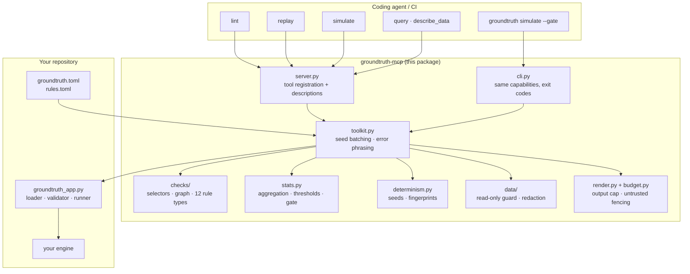
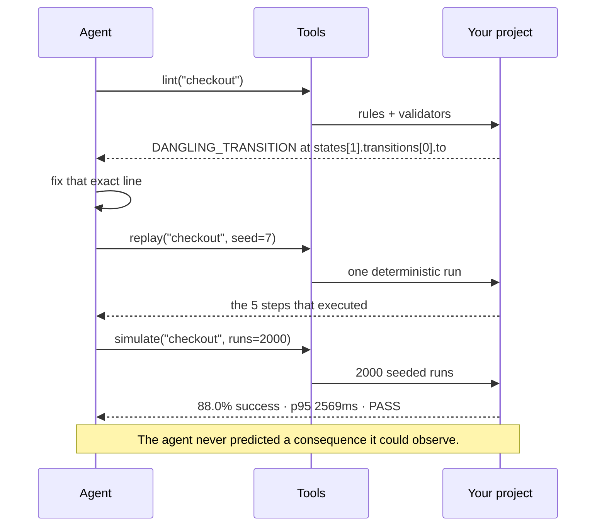

# Architecture

## The shape

Everything above the dashed line between `lib` and `yours` is the same in every
project. Everything below it is yours and nobody else can write it. The library
never learns what a state, a stage or a scenario *means*; it knows there is a
subject, that the subject can be checked, run and aggregated, and that all
three answers have to reach an agent in a shape it can act on.

## The closed loop

## Module map

| Module | Responsibility | Depends on |
|---|---|---|
| `contracts.py` | `Issue`, `Report`, `Trace`, `RunOutcome`, the error hierarchy | nothing |
| `checks/selectors.py` | the `states[].transitions[].to` path language | nothing |
| `checks/graph.py` | reachability, dead ends, self-loops, iterative Tarjan SCC | nothing |
| `checks/rules.py` | 12 declarative check types over a TOML spec | selectors, graph, contracts |
| `determinism.py` | seed derivation, fingerprints, batch comparison | nothing |
| `stats.py` | aggregation, metric expressions, thresholds, the verdict | contracts, determinism |
| `data/guard.py` | SQL validation, table allowlist, column redaction | nothing |
| `data/*_source.py` | SQLite and PostgreSQL read-only sources | guard |
| `budget.py` | output cap, `<untrusted>` fencing | nothing |
| `toolkit.py` | the registry, the seed loop, error phrasing | most of the above |
| `config.py` | `groundtruth.toml` → a configured `Toolkit` | toolkit, checks, stats, data |
| `render.py` | results → the text an agent reads | contracts, stats, budget |
| `server.py` | MCP tool registration and descriptions | toolkit, render |
| `cli.py` | the same capabilities with CI exit codes | config, toolkit, render |

The dependency graph is a DAG with no cycles and no framework at the bottom.
`checks/`, `stats.py` and `determinism.py` are independently usable — you can
import the rule engine into an existing linter without touching MCP at all.

## Decisions worth defending

### One config, two consumers

The threshold band lives in `groundtruth.toml` and nowhere else. The MCP
`simulate` tool and `groundtruth simulate --gate` are two readers of the same
list. This is not tidiness — it is the fix for a specific bug: in the codebase
this pattern was extracted from, the CI script owned the band and the
agent-facing tool kept its own copy, they drifted, and for a while the tool
reported PASS on numbers CI would have rejected. An agent optimising against a
number CI does not enforce is worse than an agent with no numbers, because it
produces confident work that fails at the gate.

### Tool descriptions are generated, not written

A model picks tools by reading their descriptions, so the descriptions are
composed at registration time from the project's own vocabulary and its actual
state: the real `subject_noun`, the real target list, the real thresholds. Two
consequences worth the complexity — the agent does not need a round trip to
learn what it may pass, and the description cannot go stale relative to the
config, because it is derived from it.

### Capabilities you did not register do not appear

`build_server` registers only what the toolkit has. A tool that always answers
"not configured" costs a call and some context to teach the agent something the
tool list could have said for free.

### Nothing crosses the MCP boundary as a traceback

Every tool catches. `ToolkitError` messages state what was wrong *and* what to
pass instead — a missing target lists the valid ones inline. An agent cannot act
on `KeyError: 'states'`; it can act on "no flow named 'chekout'; available:
standard_checkout, express_checkout, broken_checkout".

There is one deliberate asymmetry here. Missing *targets* are answered inside
the error message, because the list is short and static; there is no
`list_targets` tool. Missing *schema* gets its own `describe_data` tool,
because a schema is too large for an error message and guessing one costs three
round trips (bad query → error → retry) where one call costs one.

### The query boundary is the database, not the regex

`SqlGuard` is a keyword scan, and it says so in its own docstring. It exists to
fail fast with an actionable message. The enforcement is `mode=ro` plus
`PRAGMA query_only` on SQLite, and a `READ ONLY` transaction on PostgreSQL —
tested by going around the guard entirely and confirming the connection still
refuses. Column redaction is the one text-level control that *is* enforcement:
denied values are dropped after the fetch, before the result string exists, so
`SELECT *` cannot leak them.

### Output is capped, and data from outside is fenced

Every tool result is truncated to `[output].max_chars` with a note saying so
and how to ask for less. Rows from a data source are wrapped in `<untrusted>`
tags: a `notes` column containing something shaped like an instruction is data,
and must arrive labelled as data. The fence is not a security boundary — an
unlabelled string is simply worse, and the label costs eleven characters.

### Sync, not async

The original implementation of this pattern was async because its database
driver was. Nothing else here needs it: lint and simulate are CPU-bound,
`replay` is a single call, and MCP servers over stdio are not serving
concurrent load. Sync keeps the CLI, the tests and the stack traces simple.

## Extending it

- **A new check type**: one function in `checks/rules.py`, decorated with
  `@_check("name", requires=(...))`. It receives the document and the rule, and
  returns issues. Malformed rules must fail at load time, not check time.
- **A new data source**: any object with `available()`, `query(sql, max_rows)`
  and `schema()`. Pass it to `kit.use_data_source()`; nothing in the toolkit
  cares which database it is.
- **A new metric aggregate**: add it to `_AGGREGATES` in `stats.py` and it is
  immediately usable in a threshold expression.
